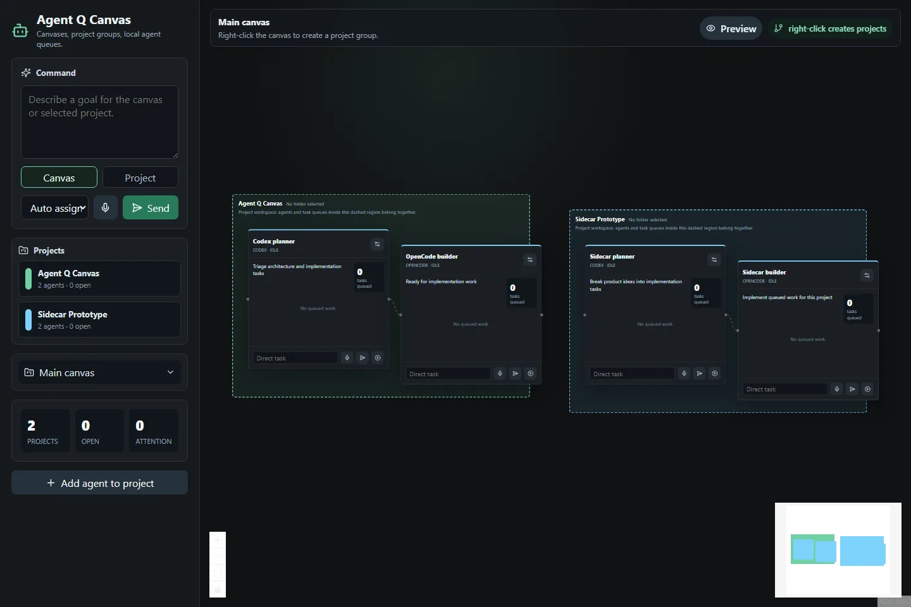
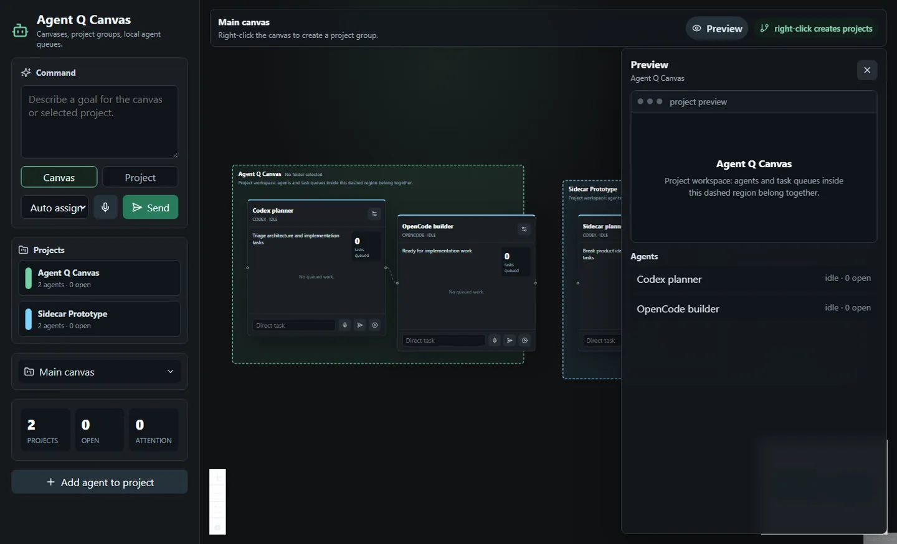
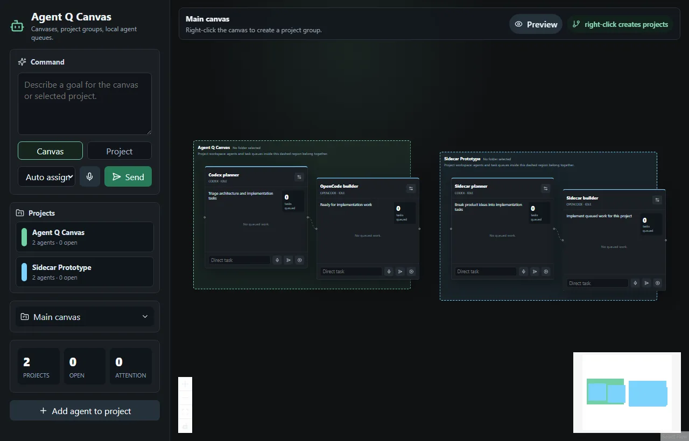

# Agent Q Canvas

Agent Q Canvas is an Electron app for coordinating local coding agents on a spatial canvas.

The core idea is simple: a user can work across multiple canvases, group work by project, place local agent nodes inside each project group, and queue tasks to those agents without losing the larger map of what is happening.

## Screenshots







## Current Features

- Electron + React + TypeScript desktop app
- ReactFlow-powered spatial canvas
- Multiple canvases
- Dashed project groups inside each canvas
- Project jump list in the left panel
- Project group dragging that moves assigned agent nodes with the project frame
- Agent nodes with:
  - provider/command identity
  - working directory field
  - local task queue
  - task status controls
  - direct task input
  - voice command hook where supported by the runtime
- Global command box with canvas/project scope
- Right-click canvas project creation
- Collapsible canvas navigator
- Preview drawer for project/agent context
- Electron preload bridge and IPC stubs for local agent process control

## Product Direction

Agent Q Canvas is aimed at users who work on several products or repositories at the same time and want local coding agents to feel coordinated instead of scattered across terminals.

Near-term direction:

- Real PTY terminals inside agent nodes or focused panels
- Codex, OpenCode, Claude Code, Gemini, and custom CLI adapters
- Browser preview nodes
- Persistent canvas/project/task state
- Git worktree isolation per project or task
- Command center for blocked agents and pending approvals
- AI-assisted task routing from high-level user instructions

## Development

Install dependencies:

```bash
npm install
```

Run the Electron dev app:

```bash
npm run dev
```

The dev server runs on:

```text
http://localhost:6060
```

Build the Electron app assets:

```bash
npm run build
```

Start from a production build:

```bash
npm start
```

## Scripts

- `npm run dev` starts Vite, Electron TypeScript watch, and Electron together.
- `npm run build` builds renderer and Electron main/preload files.
- `npm run build:renderer` builds the React/Vite renderer.
- `npm run build:main` builds Electron main/preload files.
- `npm start` builds and opens Electron.

## Reference Projects

This repo was initially shaped by studying open source agent-canvas and local-agent orchestration tools. Reference repositories are intentionally cloned into a local `references/` folder during research and are ignored by Git.

Relevant product patterns:

- spatial canvas for agent sessions
- project/worktree grouping
- task queues and task state
- local terminal or tmux-backed agent sessions
- centralized attention/approval surfaces
- preview panels for browser or runtime output

See [docs/reference-findings.md](docs/reference-findings.md) for the initial reference notes.

## Repository Hygiene

The following local or generated paths are ignored:

- `references/`
- `node_modules/`
- `dist/`
- `dist-electron/`
- `release/`
- local environment files
- social release drafts

## Status

This is an early prototype. The UI and product model are the focus right now. The local agent runtime is currently a process-control stub and should be replaced with a PTY-backed terminal runtime before serious daily use.
